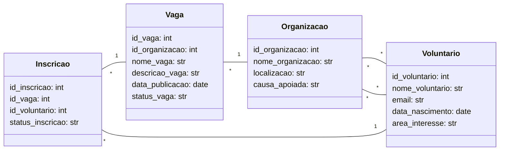

* Engaja Mais 

*  Diagrama UML

```mermaid
    classDiagram
    direction RL
    class Voluntario {
        id_voluntario: int
        nome_voluntario: str
        email: str
        data_nascimento: date
        area_interesse: str
    }

    class Organizacao {
        id_organizacao: int
        nome_organizacao: str
        localizacao: str
        causa_apoiada: str
    }

    class Vaga {
        id_vaga: int
        id_organizacao: int
        nome_vaga: str
        descricao_vaga: str
        data_publicacao: date
        status_vaga: str
    }

    class Inscricao {
        id_inscricao: int
        id_vaga: int
        id_voluntario: int
        status_inscricao: str
    }

Voluntario "*" -- "*" Organizacao
Organizacao "*" -- "*" Voluntario 
Organizacao "1" -- "*" Vaga 
Vaga "1" -- "*" Inscricao 
Voluntario "1" -- "*" Inscricao  

```